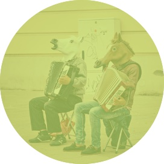

  <p align="center">
  <a href="https://nicolebarranca.github.io/Wit/" rel="noopener">
 </a>
</p>

<h1 align="center">Wit</h1>

[](https://GitHub.com/NicoleBarranca/Wit/issues/)

## Description

This website is a one stop shop for all things laughter.

---

#### Features of Wit:

```
-> Joke of the day
-> Excuses for all occasions
-> Random and useless facts

```

## Built With

- JavaScript
- HTML
- CSS

## Website

Check out [Wit](https://nicolebarranca.github.io/Wit/)!

</a>

## Contribution

Made with ❤️ by Nicole Barranca

## Questions

Feel free to contact me directly at nikkibarranca@gmail.com if you have any questions about the repo.

You can find more of my work at [Nicole Barranca](https://github.com/NicoleBarranca).
